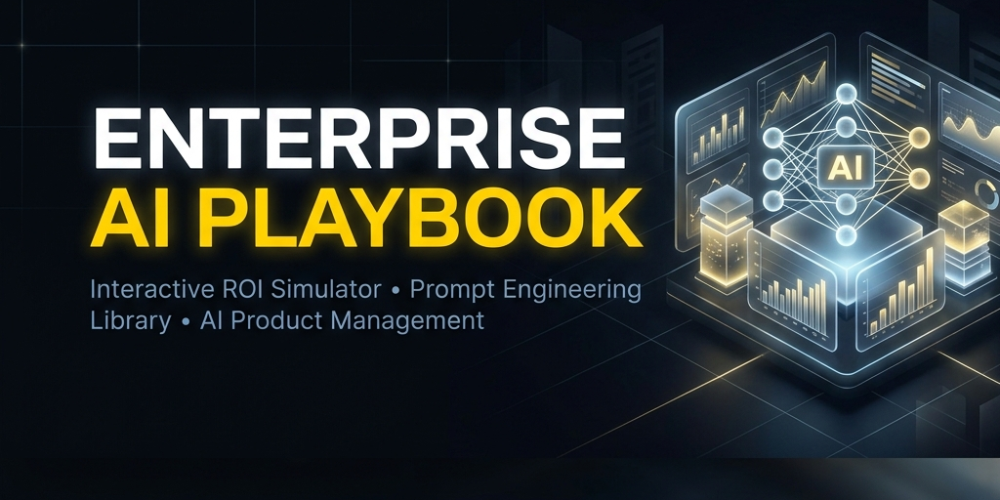
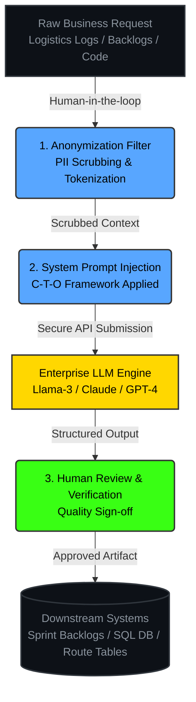

<div align="center">

<!-- Branded Premium Banner -->


# Enterprise AI Playbook & Interactive ROI Simulator 🧠

**An executive decision-support framework and interactive browser simulator demonstrating how to strategically integrate and operationalize Large Language Models (LLMs) across cross-functional enterprise roles.**

[](https://aitools-guru.github.io/enterprise-ai-playbook/prototype/)
[](./playbook/ai_business_strategy.md)
[](https://github.com/AItools-guru)
[](https://github.com/AItools-guru/enterprise-ai-playbook/actions/workflows/ci.yml)

</div>

<br />

---

## 🎯 Executive Overview
When scaling Artificial Intelligence (AI) across a modern enterprise, success is not defined by raw code—it is defined by **business alignment, strict data governance, and clear financial Return on Investment (ROI)**. 

The **Enterprise AI Playbook** provides a complete operational blueprint showing how six core business and engineering roles utilize optimized system prompts to automate critical workflows, reduce lead times, and eliminate process bottlenecks. It features a fully interactive, browser-based **ROI Simulator** where stakeholders can dynamically calculate labor savings, payback timelines, and operational multipliers in real-time.

---

## 🎛️ Live Interactive Simulator & Terminal Sandbox
> **Test the live dashboard directly in your browser — no installations or API keys required.**

🔗 **[Launch Live Simulator & Prompt Console →](https://aitools-guru.github.io/enterprise-ai-playbook/prototype/)**

The application is a responsive, single-page executive console featuring:
* ✅ **Interactive ROI Simulator:** Move sliders for Team Size, Hourly Rates, and Automation % to watch net monthly savings and payback horizons compute live.
* ✅ **Interactive System Prompt Catalog:** Click between 6 custom roles (Project Manager, Product Manager, Product Owner, Scrum Master, BA, and Software Engineer) to load production-grade prompts.
* ✅ **LLM Sandbox Terminal:** Click **"Simulate AI Execution"** to fire an animated execution log showcasing PII scrubbing, secure API submission, and a fully rendered structured output block in real-time.

---

## 🏗️ Applied AI Operations Flow
This diagram details the operational pipeline that system prompts follow to ensure enterprise compliance, data privacy, and precise business execution:



---

## 📁 Repository Structure
```
enterprise-ai-playbook/
│
├── playbook/
│   ├── ai_business_strategy.md   ← 📋 Enterprise AI integration and governance rules
│   └── prompt_engineering.md     ← 📂 Structured, production-ready system prompt library
│
├── prototype/
│   ├── index.html                ← 🔴 THE DASHBOARD WEB PROTOTYPE (Open this!)
│   ├── style.css                 ← Dark-mode glassmorphic design system stylesheets
│   └── app.js                    ← ROI algorithms and LLM sandbox terminal scripts
│
├── assets/
│   └── social_preview.png        ← Custom branded horizontal social preview banner
│
└── README.md                     ← You are here!
```

---

## 👥 Supported Roles & Strategic Prompts
The Prompt Console contains expert-calibrated system prompts for the following enterprise functions:
1. **📦 Supply Chain Analyst:** Evaluates shipping lane anomalies and calculates safety stock buffer adjustments.
2. **📋 Product Manager:** Synthesizes chaotic customer feedback logs into structured Jobs-To-Be-Done (JTBD) features.
3. **📋 Product Owner:** Break downs feature epics into sprint-ready, detailed user stories with Gherkin BDD Acceptance Criteria.
4. **📋 Project Manager:** Identifies milestone dependencies and formats critical path risk logs.
5. **⚡ Business Analyst:** Diagnoses pipeline conversion leakages and cohort churn patterns.
6. **💻 Software Engineer:** Audits database schemas and refactors slow SQL queries for high scalability.

---

## ⚙️ Running Locally (10 Seconds)

### 🎛️ Option A: Visual Browser Dashboard (Zero installations required)
To run the offline responsive glassmorphic browser dashboard locally:
```bash
# Clone the repository
git clone https://github.com/AItools-guru/enterprise-ai-playbook.git
cd enterprise-ai-playbook

# Open in any browser
open prototype/index.html
```

### 🔑 Option B: Live LLM Terminal Executor (With API Keys)
Run real prompt engineering models live against Claude-3.5-Sonnet or Gemini-1.5-Pro directly from your command-line console:
```bash
# 1. Install official LLM SDK providers
pip install anthropic google-generativeai

# 2. Configure your API key in your terminal
export ANTHROPIC_API_KEY="your-anthropic-key-here"
# OR
export GEMINI_API_KEY="your-gemini-key-here"

# 3. Run the live executor script
./playbook_live.py
```
> 💡 **Failsafe Integrated:** If no keys are configured, `playbook_live.py` automatically falls back to running a simulated pipeline console so the interface continues to operate cleanly!

---

## 🌐 Hosting on GitHub Pages (Free Recruiter Showcase)
To serve this live on your GitHub profile for recruiters:
1. Go to your repository on GitHub → **Settings → Pages**.
2. Select Source: **Deploy from branch** → **main** → **/(root)** (or **prototype/**) → **Save**.
3. Your simulator is immediately live online at:
   `https://AItools-guru.github.io/enterprise-ai-playbook/prototype/`

---

<div align="center">
<i>Designed as a Business Strategy & Operations Portfolio project — bridging financial ROI analysis, enterprise prompt engineering, and Agile software product delivery.</i>
</div>
