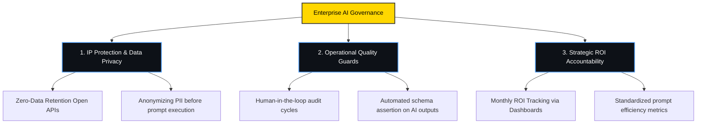

# 🧠 Applied AI Enterprise Transformation Playbook

## 📋 Executive Summary
Artificial Intelligence (AI) and Large Language Models (LLMs) are transitioning from exploratory technology tools into critical components of enterprise business architecture. This playbook provides a structured operational framework to integrate applied AI capabilities across key cross-functional roles: **Supply Chain & Logistics**, **Product Management**, **Product Ownership**, **Project Management**, **Business Analysis**, and **Software Engineering**. 

By deploying optimized system prompts, structuring AI decision workflows, and tracking clear Return on Investment (ROI) metrics, enterprise organizations can unlock massive labor savings, compress execution timelines, and eliminate cross-functional alignment bottlenecks.

---

## 📈 Enterprise AI Integration Matrix
This matrix maps how generative AI and specialized prompts are applied across key business units to optimize operational performance:

| Business Function | Core Operational Bottleneck | Applied AI Solution | Primary Success Metric |
| :--- | :--- | :--- | :--- |
| **📦 Supply Chain & Logistics** | Manual tracking of global route disruptions and cargo delays. | AI-driven anomaly and risk assessors parsing shipping logs. | **↓ 18% Transit Delay Time** |
| **📋 Product Management** | Sifting through customer feedback to identify competitive features. | Market signal synthesis and automated Product Vision generation. | **↓ 60% Opportunity Discovery Time** |
| **📋 Product Owner** | Converting vague feature ideas into sprint-ready, detailed user stories. | Automated Given-When-Then BDD User Story Generation. | **↑ 3.5x Story Writing Throughput** |
| **📋 Project Manager** | Manual tracking of milestone dependencies and execution risks. | Automated Risk Logs and Critical Path Dependency mapping. | **↓ 15% Project Execution Delay** |
| **⚡ Business Analyst** | Diagnosing revenue leakages and cohort churn patterns in spreadsheets. | Analytical diagnostic interpreters modeling pipeline metrics. | **↑ 25% Insights Extraction Speed** |
| **💻 Software Engineer** | Code review cycles, schema audits, and query optimization bottlenecks. | System architecture audits and database query refactoring engines. | **↓ 40% Pull Request Cycle Time** |

---

## 🚀 Applied AI Governance & Compliance (The 3 Pillars)
When deploying Generative AI at enterprise scale, governance is critical to safeguard corporate IP and prevent regulatory liabilities.

### 1. Intellectual Property & Data Security Guardrails
* **No Public Training:** Never input proprietary code, unannounced PRDs, or raw customer PII into public consumer LLM interfaces (like free ChatGPT). Ensure all prompts run on enterprise-licensed APIs with zero-data-retention (ZDR) agreements.
* **PII Redaction:** Implement pre-processing scripts to automatically scrub corporate identifiers, user names, and exact transaction counts before prompts exit the local network.

### 2. Operational Quality & Human-in-the-Loop
* **Strategic Verification:** AI outputs should serve as a high-fidelity first draft (a "0.5 to 0.8 version"). A qualified human domain expert must always audit, refine, and sign off on all project roadmaps, code architecture, and logistics routing.

### 3. Financial Accountability (ROI Calculation)
Every AI initiative must prove its financial viability using standard enterprise equations:
$$\text{Net Monthly Savings} = (\text{Hours Saved} \times \text{Labor Cost/Hour}) - \text{AI Platform Subscriptions}$$

---

## 🛠️ The Prompt Engineering Framework
To transition prompts from "casual chats" to "enterprise scripts," every system prompt in this library follows the **C-T-O Structure**:
1. **C - Context (Role & Rules):** Sets the persona (e.g., "You are an expert Scrum Master..."), technical constraints, and organizational objectives.
2. **T - Task (Objective):** Defines the exact analytical operation (e.g., "Analyze the raw backlog item...").
3. **O - Output (Format constraint):** Forces the LLM to output structured Markdown, Star Schema SQL, or Given-When-Then criteria, ensuring downstream compatibility.

*Refer to the complete system prompt code library in `playbook/prompt_engineering.md` to deploy these workflows.*
